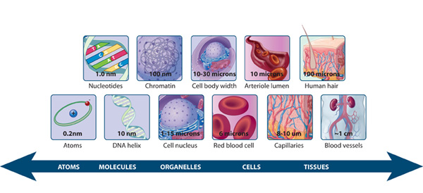
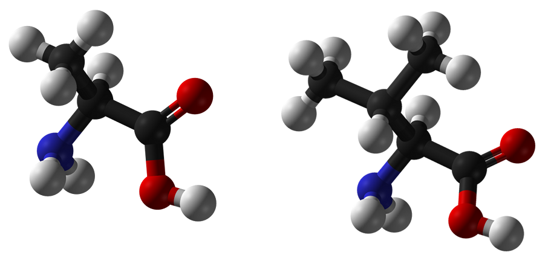
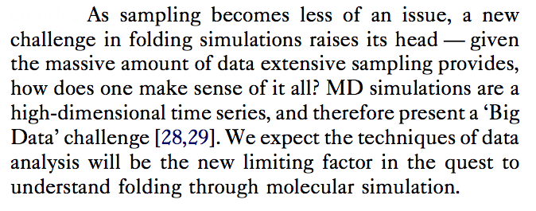

% title: 
 Hidden Markov Models are Better 

% subtitle: 
 with Applications to Ubiquitin 

% author:  Robert McGibbon 
% author:  Pande Group Meeting. January 13, 2014 
% thankyou: Thanks Everyone!
% thankyou_details: Especially Vijay, Bharath, Christian, and Matt.
% contact: www <a href="http://www.rmcgibbo.appspot.com/">website</a>
% contact: github <a href="http://github.com/rmcgibbo">rmcgibbo</a>
% favicon: http://www.stanford.edu/favicon.ico

---
title: Biology at the Atomic Length Scale

<footer class="source"> http://www.nature.com/scitable/topicpage/what-is-a-cell-14023083</footer>

---
title: Biology at the Atomic Length Scale

<table><tr>
  <td>  </td>
  <td>  </td>
</tr></table>

<footer class="source">
G.R Mallucci et. al., <i>Brain</i> 122, 1823 (1999).
</footer>

---
title: Experiments Can't Do It Alone

 

<footer class="source">

S. Westenhoff et al., <i>Nature Methods</i> 7, 775 (2010). &nbsp; | &nbsp;
G. Panick et al., <i> J. Mol. Biol. </i> 275 389 (1998)  &nbsp; | &nbsp;
Y Li et al., <i>J. Biol. Chem.</i> 277 33018 (2002)   
X. Zhuang; M. Rief, <i>Curr. Opin. Struct. Biol</i> 13 88 (2003) &nbsp; | &nbsp;
J. J. Englander et al., <i> Proc. Natl. Acad. Sci. U.S.A. </i> 100 7057 (2003)  
I J. Finkelstein et al., <i> Proc. Natl. Acad. Sci. U.S.A. </i> 104 2637 (2007)

</footer>

---
title: Molecular Dynamics

  

- Calculate the atomic-level physical interactions in the system
- Numerically integrate the equations of motion

<footer class="source">
W. D. Cornell et. al., <i>J. Am. Chem. Soc.</i> 117, 5179 (1995).
</footer>

---
title: Predictive and Interpretable models from MD
subtitle: Models are required to <i>understand</i> MD

    

    

<footer class="source">
Lane, T.J., et al. "To milliseconds and beyond: challenges in the simulation of protein folding." Current opinion in structural biology (2012).
</footer>

---
title: MSMs and HMMs
class: segue dark nobackground

---
title: Accuracy vs. Interpretability
subtitle: Goal: Accelerate scientific insight about structure and dynamics
<!-- class: img-top-center -->

- General tradeoff between model accuracy and interpretability
- In machine learning, prediction accuracy is all that matters
    * I don't care 'how' your deep neural net recognizes a cat
- In physics, accuracy without interpretability is the reductionist folly.
    * Laplace's demon won't solve protein folding.

---
title: Markov State Models
subtitle: States and Rates
class: img-top-center

    

<ul>
    <li>Discretize phase space into $N$ disjoint sets (how?), time into intervals $\tau$. </li>
    <li>Model evolution on the sets as 1st order Markov process</li>
</ul>
    $$
    T_{ij} = \mathbb{P}\left[ \mathbf{x}(t+\tau) \in S_j | \mathbf{x}(t) \in S_i \right]
    $$
<ul>
    <li>Estimate $T_{ij}$ by counting observed transitions in a collection of equilibrium trajectories</li>
</ul>

<footer class="source">
     
Prinz, Jan-Hendrik, et al. "Markov models of molecular kinetics: Generation and validation." JCP 134 (2011)
</footer>

---
title: Accuracy Problems with MSMs
subtitle: What's holding us back? 

$$ \mathcal{C}^* = \underset{\mathcal{C}} {\operatorname{argmax}}
\underbrace{\; \left[-\sum_{i=1}^{N} \sum_{\mathbf x_j \in \mathcal{C}_i} d(\mathbf x_j, \mu_i)^2\right]}_\text{clustering quality} $$

$$ \mathbf{T}^* = \underset{\mathbf{T}}{\operatorname{argmax}} \underbrace{\prod_i^{N-1} \mathbf{T}({c_{x_i} \rightarrow c_{x_{i+1}}})}_{\mathbf{T} \text{ quality, given } \mathcal{C}}$$

$$\{\mathcal{C}^*, \mathbf{T}^*\} \neq\underset{\mathcal{C}, \mathbf{T}} {\operatorname{argmax}} f(\{\mathcal{C}, \mathbf{T}\}; \mathbf{x})$$

Optimization:

- Our MSM construction does not attempt optimize any _single_ objective function
- Independent optimization of states and rates -- no unified framework.

---
title: Accuracy Problems with MSMs
subtitle: What's holding us back? 

- Brittleness: fluctuations at the of barriers & "hard" state definitions lead to *bias* towards overestimated transition rates.

- Statistical error: use of tens of thousands of states leads to high variance estimators.

<footer class="source">
<a 
href="http://link.springer.com/chapter/10.1007%2F978-94-007-7606-7_2
style="text-decoration:none;"">
Bowman, G. "An Overview and Practical Guide to Building Markov State Models"</a>
 
<a style="text-decoration:none"
href="http://dx.doi.org/10.1063/1.3590108"
style="text-decoration:none;">
Schütte, C. et. el. "Markov state models based on milestoning"</a>
</footer>

---
title: Interpretability Problems with MSMs
subtitle: What's holding us back? 

Even in a double well potential, quantitatively  
resolving the eigenfunctions requires  
more than two MSM states.

- Difficulty of interpretation is proportional to the number of states
    - And many are needed for accurate predictions.
- Even tougher to visualize the eigenprocesses when the states are implicitly defined (e.g. RMSD)

---
title: What's an HMM?

    
    

    $$ S_0 \sim \operatorname{Multinomial}(\pi) $$
    $$ S_{t+1} \sim \operatorname{Multinomial}(\mathbf{T}_{s_t}) $$
    $$ X_{t} \sim f(\,\cdot\,; \theta_{s_t}) $$
    

    

- States are *unobserved*, but an output, dependent probabilistically on the state, is visible.
- Each state is equipped with an *output distribution* $f(\mathbf{x}; \theta_s)$, which need not be orthogonal.

 $$
f(\mathbf{x}; \theta_{s_t}) = \mathbb{P}(X_t = \mathbf{x} | S_t = s)
$$ 

---
title: Likelihood function

Joint distribution over a data *and* state sequence from $0$ to $t$

 $$
\mathbb{P}(\mathbf{x}_{0:t}, s_{0:t}) = \pi_{s_0} f(\mathbf{x}_0; \theta_{s_0}) \prod_{i=1}^t \bold{T}_{s_t, s_{t+1}} \cdot f(\mathbf{x}_t; \theta_{s_t})
$$ 

Likelihood formally requires summing over all possible paths

 $$
\mathcal{L} = \mathbb{P}(\mathbf{x}_{0:t} | \mathbf{T}, \theta) = \sum_{\{s_{0:t}\}} \mathbb{P}(\mathbf{x}_{0:t}, s_{0:t}) 
$$ 

---
title: Learning the model

$$
\mathbb{P}(\mathbf{x}_{0:t} | \mathbf{T}, \theta ) = \sum_{\{s_{0:t}\}} \left[ \pi_{s_0} f(\mathbf{x}_0; \theta_{s_0}) \prod_{i=1}^t \bold{T}_{s_t, s_{t+1}} \cdot f(\mathbf{x}_t; \theta_{s_t}) \right]
$$

$$
\{ \mathbf{T}^*, \theta^* \} = \underset{\{\mathbf{T}, \theta\}}{\operatorname{argmax}} \; \mathbb{P}(\mathbf{x}_{0:t} | \mathbf{T}, \theta )
$$

- We fit the *maximum likelihood* model, adjusting the transition matrix, states' means, and (co)variances.
- Maximize the probability that the model would *generate* the observed data, if we sampled from the HMM.

---
title: HMM Details
class: segue dark nobackground

---
title: Learning the model
subtitle: Baum-Welch (EM)

- E-step: computed expected hidden state sequence, given current $\mathbf{T}, \theta$.
    - Distribution over the states at each time: $\mathbb{P}(S_t = i)$
    - Computational complexity: $O(T \, N^2)$
- M-step: Find new $\mathbf{T}, \theta$ that maximize likelihood, with $S$ fixed as above
    - Fitting gaussian to data, maximum likelihood reversible transition matrix.

---
title: E-Step: Forward Algorithm

Forward algorithm recursively computes the probability of of $S_t$ given the observed signal $X$ from $t=0$ to $t$.

$$\begin{aligned}
\alpha(s_{t+1}) = \mathbb{P}(s_{t+1}, \mathbf{x}_{0:t+1}) &amp; = \sum_{s_t} \mathbb{P} (s_{t+1}, s_t, \mathbf{x}_{0:t}, \mathbf{x}_{t+1}) \\
&amp; = \mathbb{P}(\mathbf{x}_{t+1} | s_{t+1}) \sum_{s_t} \mathbb{P}(s_{t+1} | s_t) \mathbb{P}(s_t, \mathbf{x}_{0:t}) \\
&amp; = f(\mathbf{x}_{t+1}; \theta_{s_{t+1}}) \sum_{s_t} \mathbf{T}_{s_t, s_{t+1}} \alpha(s_t)
\end{aligned}$$

$$
\mathcal{L}(\mathbf{x}; \{\mathbf{T}, \theta\}) = \sum_{s_t} \mathbb{P}(s_t, x_{0:t}) = \sum_{s_t} \alpha(s_t)
$$

---
title: E-Step: Backward algorithm

Observations from $t=t+1$ to $T$ also give evidence about the state $S_t$ that can be computed recursively

$$\begin{aligned}
\beta(s_{t}) = \mathbb{P}(\mathbf{x}_{t+1:T} | s_t) &amp; = \sum_{s_{t+1}} \mathbb{P}(\mathbf{x}_{t+1:T} | s_{t+1}) \mathbb{P}(s_{t+1} | s_t) \\
&amp; = \sum_{s_{t+1}} \mathbb{P}(\mathbf{x}_{t+1}, \mathbf{x}_{t+2:T} | s_{t+1}) \mathbb{P}(s_{t+1} | s_t) \\
&amp; = \sum_{s_{t+1}} \mathbb{P}(\mathbf{x}_{t+1} | s_{t+1}) \mathbb{P}(\mathbf{x}_{t+2:T} | s_{t+1}) \mathbb{P}(s_{t+1} | s_t)  \\
&amp; = \sum_{s_{t+1}} f(\mathbf{x}_{t+1}; \theta_{s_{t+1}}) \, \mathbf{T}_{s_t, s_{t+1}} \, \beta(s_{t+1}) \\
\end{aligned}$$

---
title: E-Step: Final Quantities

$$\begin{aligned}
\gamma_i(t) &amp; = \mathbb{P}(S_t=i | \mathbf{x}_{0:T}) \\
&amp; = \frac{\alpha_i(t) \beta_i(t)}{\sum_j \alpha_j(t) \beta_j(t)} \\
\xi_{ij}(t)  &amp; = \mathbb{P}(S_t = i, S_{t+1} = j | \mathbf{x}_{0:T}) \\
 &amp; = \frac{\alpha_i(t) \mathbf{T}_{ij} \beta_j(t+1) f(\mathbf{x}_{t+1}; \theta_{s_j})}{\sum_{kl} \alpha_k(t) \mathbf{T}_{kl}  \beta_l(t+1)  f(\mathbf{x}_{t+1};  \theta_{s_l}) }
\end{aligned}$$

---
title: M-Step: Update Equations

$$
^{(k+1)} \mu_i = \frac{\sum_t \gamma_i(t) \mathbf{x}_t}{\sum_t \gamma_i(t)}
$$

$$
^{(k+1)} \sigma^2_i = \frac{\sum_t \gamma_i(t) (\mathbf{x}_t-\mu_i)^2}{\sum_t \gamma_i(t)}
$$

$$
^{(k+1)} \mathbf{T} = \underset{\mathbf{T}} {\operatorname{argmax}} \sum_{ij} \log (\mathbf{T}_{ij}) \sum_t \xi_{ij}(t)
$$

---
title: L1 Regularization

---
title: Tradeoffs
subtitle: Losses in using the HMM over the MSM

- Evolution of $X_t$ in the HMM is _not_ Markovian.
    - $\mathbb{P}(X_t | X_{t-1}, X_{t-2}, \ldots) \neq \mathbb{P}(X_t | X_{t-1} )$
- HMM is _not_ a direct discretization of the transfer operator.
    - Connections to spectral theory / operators are weaker.
- Each conformation $X_t$ is _not_ uniquely assigned to a single state.
- Fitting with very large numbers of states is not practical.

---
title: Tradeoffs
subtitle: Gains in using the HMM over the MSM

- None of the arbitrariness of the MSM state decomposition
    - The state locations and widths can be  optimized
- All of the ML machinery is now available
    - Cross validation
    - Model selection (AIC, BIC)
- Direct macrostate models

---
title: Implementation
subtitle: CPU (SSE+OpenMP), CUDA

<pre class="prettyprint" data-lang="python">
>>> import numpy as np
>>> import mdtraj as md
>>>
>>> trajectory = md.load('trajectory.xtc', top='structure.pdb')
>>> distances = md.compute_distances(trajectory, np.loadtxt('AtomIndices.dat'))
>>>
>>> from mixtape.ghmm import GaussianFusionHMM
>>> model = GaussianFusionHMM(n_states=4, n_features=len(atom_indices), platform=<b>'cuda'</b>)
>>> model.fit([distances])
>>>
>>> print model.transmat_
[[ 0.966  0.033  0.001  0.001]
 [ 0.002  0.945  0.002  0.051]
 [ 0.001  0.012  0.959  0.028]
 [ 0.021  0.038  0.029  0.912 ]]
</pre>